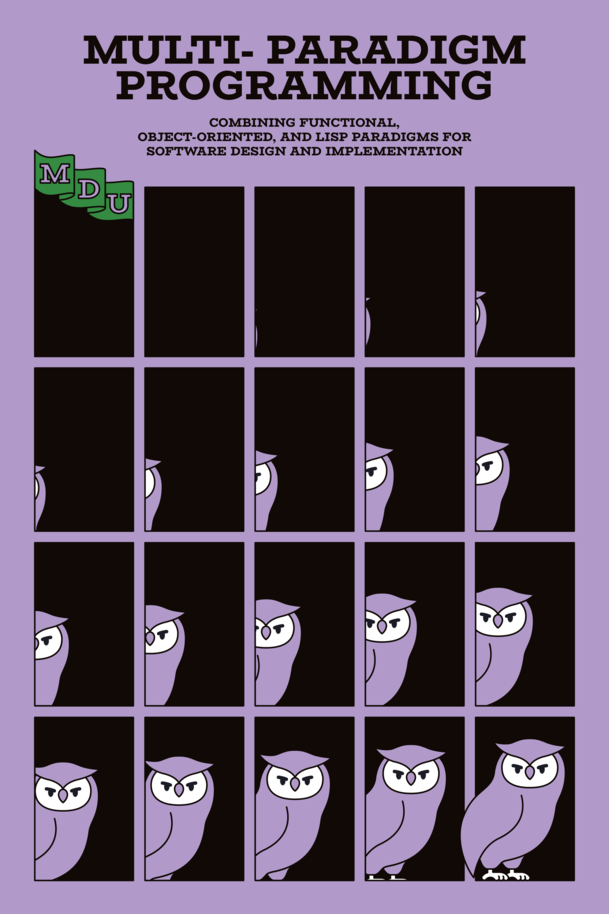

# Multiparadigm Programming using C#

This repository is for Coding-Kata based on below book contents using C# language not JS/TS.

	

> https://leanpub.com/multi-paradigm-programming

## Expected Results

- Essential Understanding About Functional Programming
- Programatic and Tactical Skill Using Iterable/Iterator
